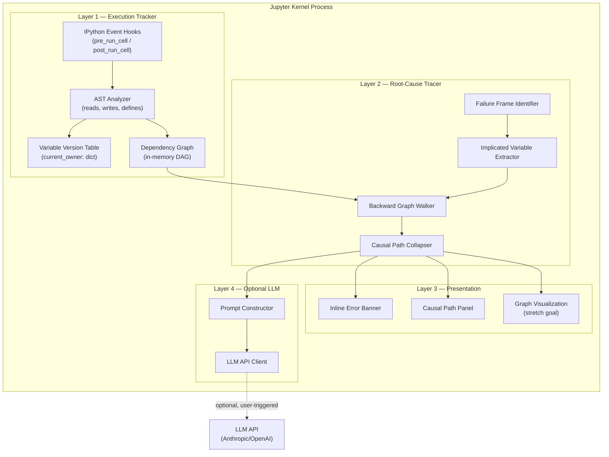
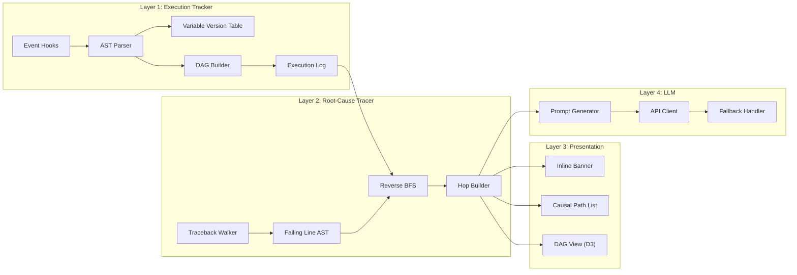
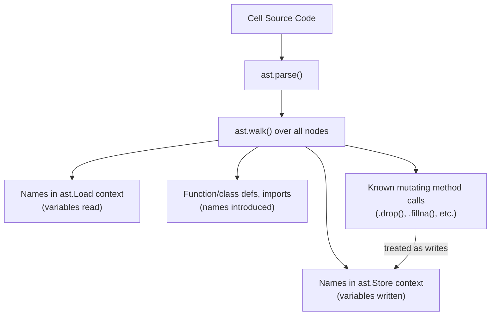
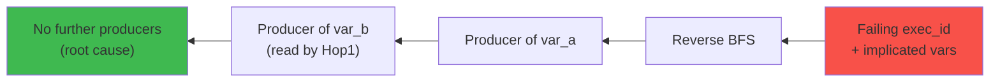
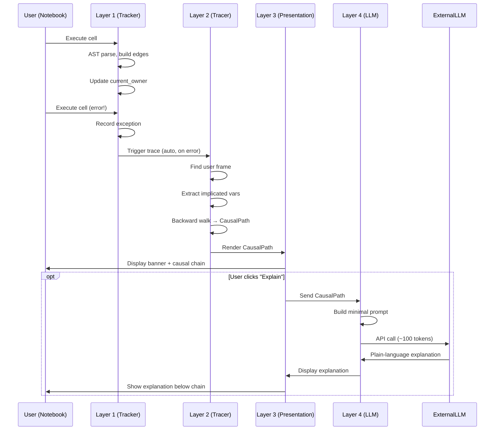

# BookError — Technical Architecture

## High-Level Architecture

BookError is a **three-layer system with an optional fourth layer**, running entirely within the Jupyter kernel process. There is no separate server, no database, and no external dependencies for core functionality.



### Why This Architecture

- **In-process, no server:** The tracker runs inside the kernel where cells execute. This gives direct access to the IPython event system, the user namespace, and exception objects — no serialization, no IPC, no latency.
- **Layer separation:** Each layer is independently testable. Layer 1 can be verified by inspecting the graph after cell executions. Layer 2 can be tested with a pre-built graph and a synthetic exception. Layer 3 is pure rendering logic over a `CausalPath` object.
- **LLM is purely additive:** Layers 1–3 work with zero external calls. Layer 4 is decoupled and disabled by default. This is a deliberate design choice: the tool's value comes from the graph, not from AI.

---

## Component Architecture



---

## Folder Structure

```
bookerrror/
├── docs/                              # Project documentation
│   ├── solution.md                    # Original technical solution document
│   ├── prd.md                         # Product requirements
│   ├── architecture.md                # This file
│   ├── design.md                      # UI/UX design
│   ├── phases.md                      # Implementation roadmap
│   ├── rules.md                       # Project conventions
│   └── memory.md                      # Living project memory
│
├── bookerrror/                        # Python package (the extension)
│   ├── __init__.py                    # Package init, version, public API
│   ├── extension.py                   # JupyterLab/IPython extension entry point
│   │
│   ├── tracker/                       # Layer 1 — Execution Tracker
│   │   ├── __init__.py
│   │   ├── hooks.py                   # IPython event hook registration
│   │   ├── ast_analyzer.py            # AST parsing for reads/writes/defines
│   │   ├── version_table.py           # Variable-to-exec_id ownership mapping
│   │   ├── graph.py                   # Dependency DAG construction and storage
│   │   └── models.py                  # ExecutionRecord, Edge data classes
│   │
│   ├── tracer/                        # Layer 2 — Root-Cause Tracer
│   │   ├── __init__.py
│   │   ├── frame_walker.py            # Walk traceback to find user-code frame
│   │   ├── var_extractor.py           # Extract implicated variables from failing line
│   │   ├── graph_walker.py            # Backward BFS/DFS over the dependency DAG
│   │   ├── collapser.py              # Collapse raw chain into CausalPath
│   │   ├── summarizer.py             # Generate one-line hop summaries from AST
│   │   └── models.py                  # CausalHop, CausalPath data classes
│   │
│   ├── presentation/                  # Layer 3 — Presentation
│   │   ├── __init__.py
│   │   ├── banner.py                  # Inline error banner (IPython display)
│   │   ├── path_display.py            # Causal path list rendering
│   │   └── graph_widget.py            # Graph visualization widget (stretch)
│   │
│   ├── llm/                           # Layer 4 — Optional LLM Explanation
│   │   ├── __init__.py
│   │   ├── prompt_builder.py          # Construct minimal prompt from CausalPath
│   │   ├── client.py                  # LLM API client (Anthropic/OpenAI)
│   │   └── config.py                  # LLM configuration (API key, model, toggle)
│   │
│   └── utils/                         # Shared utilities
│       ├── __init__.py
│       ├── ipython_helpers.py         # IPython namespace and cell ID utilities
│       └── constants.py               # Mutating method lookup table, patterns
│
├── labextension/                      # JupyterLab frontend extension (stretch)
│   ├── package.json
│   ├── tsconfig.json
│   ├── src/
│   │   ├── index.ts                   # Extension entry point
│   │   ├── CausalPathPanel.tsx        # Causal path sidebar panel
│   │   ├── GraphView.tsx              # Dependency graph visualization
│   │   ├── CellHighlighter.ts         # Cell highlight/scroll logic
│   │   └── types.ts                   # TypeScript type definitions
│   └── style/
│       └── index.css                  # Extension styles
│
├── demo/                              # Demo notebooks
│   ├── demo_keyerror.ipynb            # KeyError from out-of-order column drop
│   ├── demo_attributeerror.ipynb      # AttributeError from variable overwrite
│   └── README.md                      # Demo setup and run instructions
│
├── tests/                             # Test suite
│   ├── test_ast_analyzer.py           # AST read/write extraction tests
│   ├── test_graph.py                  # Graph construction tests
│   ├── test_graph_walker.py           # Backward walk tests
│   ├── test_collapser.py             # Chain collapse tests
│   ├── test_summarizer.py            # Hop summary generation tests
│   └── fixtures/                      # Test fixtures (mock execution records)
│       └── sample_graphs.py
│
├── pyproject.toml                     # Package configuration (PEP 621)
├── setup.cfg                          # Optional legacy config
├── .gitignore
└── README.md
```

### Why This Structure

- **Single Python package (`bookerrror/`):** The core system is pure Python with no external build step. It can be loaded as an IPython extension with `%load_ext bookerrror` — the simplest possible installation for a hackathon demo.
- **Layer-per-directory:** Each layer maps to a directory. Dependencies flow downward (Layer 2 imports from Layer 1, Layer 3 imports from Layer 2). No circular dependencies.
- **Separate `labextension/` directory:** The JupyterLab TypeScript extension is a stretch goal. It lives outside the Python package to keep the core dependency-free. The Python-only version renders via IPython `display()` and works without it.
- **`demo/` notebooks:** Pre-scripted demonstrations. These are the hackathon deliverable.

---

## Layer 1 — Execution Tracker (Backend Core)

### Technology: Pure Python + IPython Events API + `ast` Module

**Why pure Python:** No external dependencies needed. The `ast` module is in the standard library. IPython's event system is available in every Jupyter kernel. This means zero `pip install` dependencies for the core tracker.

### Hook Registration

```python
# extension.py
from IPython import get_ipython

def load_ipython_extension(ipython):
    """Called when user runs %load_ext bookerrror"""
    tracker = ExecutionTracker()
    ipython.events.register('pre_run_cell', tracker.pre_run_cell)
    ipython.events.register('post_run_cell', tracker.post_run_cell)
    # Store tracker on the IPython instance for access by other layers
    ipython._bookerrror_tracker = tracker

def unload_ipython_extension(ipython):
    tracker = getattr(ipython, '_bookerrror_tracker', None)
    if tracker:
        ipython.events.unregister('pre_run_cell', tracker.pre_run_cell)
        ipython.events.unregister('post_run_cell', tracker.post_run_cell)
        del ipython._bookerrror_tracker
```

### AST Analysis Strategy

The AST analyzer operates on each cell's source code to extract:



**Key design decisions:**

1. **Mutations as writes:** A lookup table of ~20 common pandas/numpy/sklearn mutating methods (`.drop()`, `.dropna()`, `.fillna()`, `.astype()`, `.reset_index()`, `.merge()`, `.concat()`, `.append()`, `.pop()`, `.insert()`, `.loc[...] = ...`, `.iloc[...] = ...`, `.fit()`, `.fit_transform()`) is used to detect in-place mutations. When `df.drop(columns=['age'])` is detected, `df` is recorded as both read and written.

2. **Scope filtering:** Only top-level (module scope) reads and writes are tracked. Variables inside function bodies are ignored unless they reference globals explicitly. This avoids false edges from local variables sharing names with globals.

3. **Builtins excluded:** Names like `print`, `range`, `len`, `True`, `False`, `None` are excluded from the read set.

### Data Model

```python
from dataclasses import dataclass, field
from typing import Optional

@dataclass
class ExecutionRecord:
    exec_id: int               # Monotonically increasing, one per cell run
    cell_id: str               # Stable Jupyter cell ID (persists across edits/re-runs)
    timestamp: float           # time.time() at execution start
    source: str                # Exact code that ran
    reads: set[str]            # Variable names read
    writes: set[str]           # Variable names written/defined
    defines: set[str]          # Functions/classes/imports newly introduced
    raised: Optional[ExceptionInfo] = None  # Exception details if cell errored

@dataclass
class ExceptionInfo:
    exc_type: str              # e.g., "KeyError"
    exc_message: str           # e.g., "'age'"
    failing_line: str          # The actual line of code that raised
    frame_filename: str        # IPython cell execution filename
    frame_lineno: int          # Line number within the cell

@dataclass
class Edge:
    producer_exec_id: int      # The execution that wrote the variable
    consumer_exec_id: int      # The execution that read the variable
    variable: str              # The variable name connecting them
```

### Graph Construction

```python
class DependencyGraph:
    def __init__(self):
        self.records: list[ExecutionRecord] = []
        self.edges: list[Edge] = []
        self.current_owner: dict[str, int] = {}  # var_name -> exec_id
        self._next_exec_id: int = 0

    def record_execution(self, cell_id: str, source: str, reads: set[str],
                         writes: set[str], defines: set[str],
                         raised: Optional[ExceptionInfo] = None) -> ExecutionRecord:
        exec_id = self._next_exec_id
        self._next_exec_id += 1

        record = ExecutionRecord(
            exec_id=exec_id, cell_id=cell_id, timestamp=time.time(),
            source=source, reads=reads, writes=writes,
            defines=defines, raised=raised,
        )
        self.records.append(record)

        # Build edges: for each variable read, link to its current owner
        for var in reads:
            if var in self.current_owner:
                self.edges.append(Edge(
                    producer_exec_id=self.current_owner[var],
                    consumer_exec_id=exec_id,
                    variable=var,
                ))

        # Update ownership: this execution now owns all written variables
        for var in writes | defines:
            self.current_owner[var] = exec_id

        return record
```

**Why this produces a DAG:** `exec_id`s are monotonically increasing. Edges only point from a lower `exec_id` (producer) to a higher `exec_id` (consumer). Cycles are impossible by construction.

---

## Layer 2 — Root-Cause Tracer

### Traceback Frame Walking

When a cell raises an exception, Layer 2 walks the traceback to find the **innermost frame in user notebook code**:

```python
def find_user_frame(exc: BaseException) -> Optional[FrameInfo]:
    """Walk traceback to find the innermost user-code frame."""
    tb = exc.__traceback__
    user_frame = None
    while tb is not None:
        filename = tb.tb_frame.f_code.co_filename
        # IPython cell executions have filenames like '<ipython-input-N-hash>'
        # or '/tmp/ipykernel_PID/CELLID.py'
        if is_ipython_cell_filename(filename):
            user_frame = FrameInfo(
                filename=filename,
                lineno=tb.tb_lineno,
                locals=tb.tb_frame.f_locals.copy(),
            )
        tb = tb.tb_next
    return user_frame
```

### Backward Graph Walk



The walk is bounded:
- **By graph size:** Typical notebook sessions have tens to low hundreds of `exec_id`s. The walk visits each at most once.
- **By depth:** In practice, causal chains are 2–6 hops. The walk terminates when no further producers exist.
- **Time complexity:** O(V + E) where V = number of executions, E = number of edges. Millisecond-scale for any realistic notebook.

### Causal Path Output

```python
@dataclass
class CausalHop:
    cell_id: str          # Jupyter cell ID
    exec_id: int          # Which execution of that cell
    variable: str         # The variable connecting this hop to the next
    summary: str          # e.g., "dropped column 'age' from df"
    source_snippet: str   # The relevant line(s) of code

@dataclass
class CausalPath:
    failure: FailureInfo  # Exception details + failing cell/line
    hops: list[CausalHop] # Chronological, earliest cause first
```

This is the **single artifact** consumed by Layers 3 and 4. It is small (typically 2–6 hops) regardless of notebook size.

---

## Layer 3 — Presentation

### MVP: IPython Display Output (Pure Python)

For the hackathon, Layer 3 renders directly into cell output areas using IPython's `display()` and `HTML()` functions. This requires zero TypeScript and zero JupyterLab extension infrastructure.

```python
from IPython.display import display, HTML

def render_causal_banner(path: CausalPath):
    """Render the inline error banner below the failing cell."""
    html = f"""
    <div class="bookerrror-banner">
        <div class="banner-header">
            <span class="banner-icon">🔍</span>
            <strong>{path.failure.exc_type}: {path.failure.exc_message}</strong>
        </div>
        <div class="banner-body">
            Root cause traced to <strong>Cell [{path.hops[0].cell_id}]</strong>
            (execution #{path.hops[0].exec_id})
        </div>
        <div class="causal-chain">
            {''.join(render_hop(h, i) for i, h in enumerate(path.hops))}
        </div>
    </div>
    """
    display(HTML(html))
```

**Why HTML-in-output over a JupyterLab panel:** A JupyterLab extension requires TypeScript compilation, a build pipeline, and `jupyter labextension install`. For an 18-hour hackathon, rendering styled HTML directly into cell outputs is orders of magnitude faster to build and demo. The full panel is a stretch goal.

### Stretch: JupyterLab Extension (TypeScript/React)

If time allows, a proper JupyterLab sidebar panel provides:
- A persistent causal path view (not lost when scrolling).
- Click-to-navigate that scrolls the notebook and highlights cells.
- The interactive graph visualization.

**Technology:** JupyterLab extension API + React (JupyterLab uses Lumino/React internally). The extension communicates with the Python backend via Jupyter's `comm` messaging system.

### Graph Visualization (Stretch Goal)

The dependency DAG is rendered client-side using **D3.js** (if in a JupyterLab extension) or a lightweight Python graph library like **ipycytoscape** (if staying in pure Python widget territory).

For the hackathon, the simplest viable option is a **Python-generated SVG** rendered inline:

```python
def render_graph_svg(graph: DependencyGraph, causal_path: CausalPath) -> str:
    """Generate an SVG of the dependency graph with causal path highlighted."""
    # Use a simple layered layout algorithm
    # Nodes = exec_ids, positioned by execution order
    # Edges = dependency edges, colored by causal membership
    ...
```

---

## Layer 4 — Optional LLM Explanation

### Prompt Construction

```python
def build_prompt(path: CausalPath) -> str:
    lines = [
        "A Jupyter notebook raised an error. Here is the causal chain that led to it,",
        "already identified by static analysis — do not re-diagnose, just explain it",
        "plainly in 2-3 sentences for a student:\n",
    ]
    for i, hop in enumerate(path.hops, 1):
        lines.append(f"{i}. Cell [{hop.cell_id}] {hop.summary}")

    lines.append(f"\n{len(path.hops)+1}. Cell [{path.failure.cell_id}] crashed: "
                 f"{path.failure.exc_type}: {path.failure.exc_message}")
    lines.append(f"   Failing line: {path.failure.failing_line}")
    lines.append("\nExplain what went wrong and what the student should look at, in plain language.")
    return "\n".join(lines)
```

**Token footprint:** This prompt is 60–150 tokens regardless of notebook size. A naive approach (pasting the full traceback + surrounding cells) typically runs 500–2000+ tokens.

### API Client

```python
import httpx

async def explain(prompt: str, config: LLMConfig) -> str:
    """Call the configured LLM with the minimal prompt."""
    async with httpx.AsyncClient(timeout=10.0) as client:
        response = await client.post(
            config.api_url,
            headers={"Authorization": f"Bearer {config.api_key}"},
            json={
                "model": config.model,
                "messages": [{"role": "user", "content": prompt}],
                "max_tokens": 200,
            },
        )
        response.raise_for_status()
        return response.json()["choices"][0]["message"]["content"]
```

**Failure handling:** If the API call fails, times out, or the user has no API key configured, the system falls back to the deterministic hop summaries from Layer 2. The tool is fully functional without this layer.

---

## Data Model Summary

```
Notebook Session (in-memory, kernel process)
 ├── ExecutionRecord[]              (Layer 1, append-only log)
 ├── current_owner: dict[str, int]  (Layer 1, mutable index: var_name → exec_id)
 ├── DependencyGraph                (Layer 1, derived, in-memory DAG)
 │      nodes = exec_ids
 │      edges = "provides(var)" from producer exec_id → consumer exec_id
 └── CausalPath                     (Layer 2, produced on-demand per error)
        failure: FailureInfo
        hops: CausalHop[]
```

**No persistent storage for the MVP.** The graph lives in kernel-process memory. This is intentional: notebook sessions are ephemeral, and the graph is cheap to rebuild (it's built incrementally as cells run).

---

## Tech Stack

| Component | Choice | Why |
|---|---|---|
| Kernel-side hooks | IPython `events` API | Native hook points, zero external deps, fires on every cell execution |
| Static analysis | Python `ast` module | Standard library, fast, sufficient for read/write extraction |
| Graph structure | Python `dict` + `list` (plain adjacency lists) | Graph is small (hundreds of nodes max); `networkx` is an unnecessary dependency |
| MVP presentation | IPython `display()` + `HTML()` | Zero build step, renders directly in cell outputs, fastest path to a working demo |
| Stretch: frontend panel | JupyterLab extension (TypeScript/React) | Standard JupyterLab extension API; enables sidebar, cell highlighting, graph view |
| Stretch: graph rendering | D3.js (in labextension) or inline SVG (in Python) | Client-side rendering of a small DAG |
| Optional LLM | `httpx` + any OpenAI-compatible API | Only for Layer 4; async, timeout-aware, swappable |
| Packaging | `pyproject.toml` (PEP 621) | Modern Python packaging standard |

---

## Communication Between Layers

### Python-Only Mode (MVP)

All layers run in the same Python process. Layer 2 directly imports from Layer 1's data structures. Layer 3 directly receives `CausalPath` objects. No IPC needed.



### JupyterLab Extension Mode (Stretch)

When the JupyterLab extension is installed, the Python backend communicates with the TypeScript frontend via **Jupyter Comms** (the standard kernel↔frontend messaging channel):

```python
# Python side
comm = ipython.kernel.comm_manager.register_target('bookerrror')
comm.send({'type': 'causal_path', 'data': causal_path.to_dict()})
```

```typescript
// TypeScript side
const comm = kernel.connectToComm('bookerrror');
comm.onMsg = (msg) => {
    const data = msg.content.data;
    if (data.type === 'causal_path') {
        setCausalPath(data.data);
    }
};
```

---

## Error Handling Strategy

### Layer 1 (Tracker)
- **Never crash the kernel.** All hook handlers are wrapped in try-except. If AST parsing fails on a cell (e.g., syntax errors, magics), the cell is recorded as an opaque node with empty reads/writes.
- **Never slow down execution.** If any tracker operation takes > 100ms (shouldn't happen, but safety net), log a warning and skip.

### Layer 2 (Tracer)
- **No user-code frame found:** Report the exception normally without a causal chain. The inline banner says "Could not trace this error to an earlier cell."
- **Graph walk produces empty chain:** Same behavior. The error is reported as-is.
- **Implicated variable not in the graph:** The variable was likely a literal or built-in. Report the error without a chain.

### Layer 3 (Presentation)
- **HTML rendering fails:** Fall back to plain text output of the causal chain.
- **Cell navigation fails (cell ID not found):** Show the hop without a clickable link.

### Layer 4 (LLM)
- **No API key configured:** The "Explain" button is hidden or grayed out.
- **API call fails/times out:** Show the deterministic summaries with a note: "LLM explanation unavailable."
- **API returns unexpected format:** Show the raw response or fall back to summaries.

### Principle: Never Break the User's Notebook

BookError must be invisible when things go right and helpful when things go wrong. A bug in BookError itself must never prevent the user from running their notebook normally. If the tracker crashes, the notebook continues working — just without causal analysis.

---

## Security Considerations

- **API keys for Layer 4:** Stored in environment variables (`BOOKERRROR_API_KEY`) or Jupyter's config system. Never logged, never included in error reports.
- **No telemetry:** BookError never phones home. All analysis is local.
- **No code execution:** BookError only reads code via AST parsing. It never `exec()`s or `eval()`s user code.
- **No network calls** except Layer 4's optional, user-triggered LLM API call.

---

## Deployment

### Hackathon (Simplest Possible)

```bash
# In the notebook:
%load_ext bookerrror
```

That's it. No `pip install`, no extension build, no config. The extension is loaded from the local source directory.

### Post-Hackathon

```bash
pip install bookerrror
# Automatically registers as an IPython extension
# Optionally: jupyter labextension install bookerrror
```
