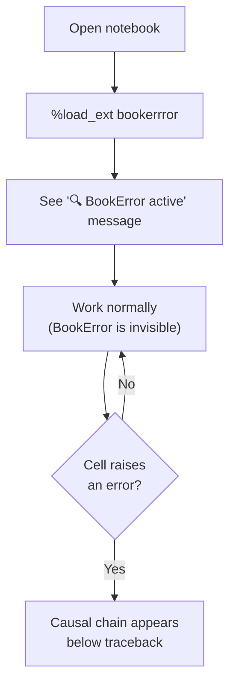
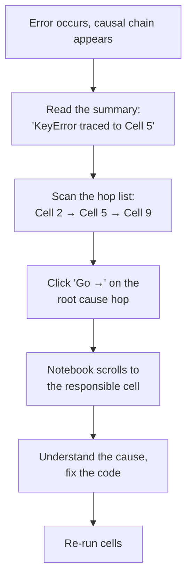
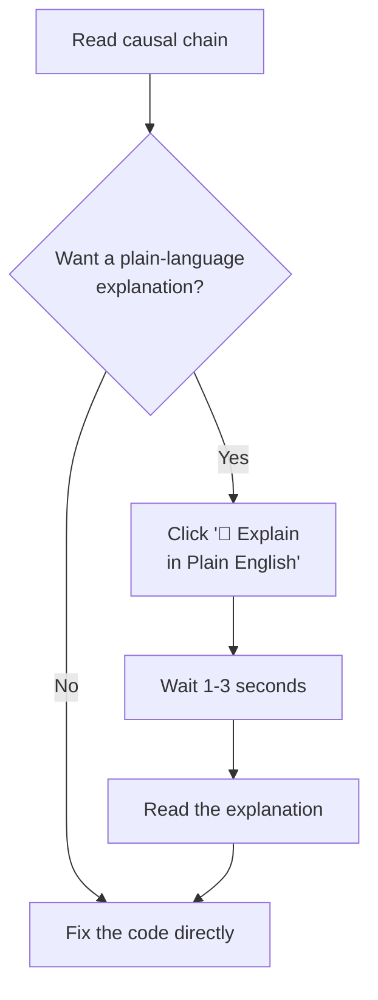

# BookError — UI/UX Design

## Design Principles

1. **Diagnosis, Not Dashboard.** Every element exists to answer one question: "Which earlier cell caused this error?" No decorative charts, no metrics panels.
2. **Instant Insight.** The causal path must appear within 1 second of the error. No loading spinners, no "analyzing…" messages for the core diagnosis.
3. **Non-Intrusive.** BookError renders *below* the error output, extending the notebook's natural flow. It never covers notebook content, never pops up modals, never steals focus.
4. **Familiar to Notebook Users.** Use notebook-native visual patterns: cell-like containers, monospace code, numbered lists. The user should not feel like they've left JupyterLab.
5. **Progressive Disclosure.** Show the summary by default. Reveal the detailed chain, graph, and LLM explanation only on user interaction.

---

## Visual Identity

### Color System

BookError uses JupyterLab's dark theme colors as a base, with a focused accent palette for causal chain elements:

```
Background (inherits JupyterLab theme):
  --be-bg-banner:       #1e2a3a       (banner background, slightly distinct from notebook bg)
  --be-bg-hop:          #1a2332       (hop card background)
  --be-bg-hover:        #243044       (hover state on hops)

Borders:
  --be-border:          #2d3f54       (default borders)
  --be-border-error:    #f85149       (error accent border)
  --be-border-causal:   #58a6ff       (causal path accent)

Text:
  --be-text-primary:    #e6edf3       (main text)
  --be-text-secondary:  #8b949e       (labels, metadata)
  --be-text-code:       #79c0ff       (code snippets)

Causal Chain Colors:
  --be-root-cause:      #f0883e       (orange — the root cause hop)
  --be-intermediate:    #58a6ff       (blue — intermediate hops)
  --be-failure:         #f85149       (red — the failing cell)
  --be-graph-path:      #f0883e       (orange — causal path highlight in graph)
  --be-graph-dim:       #30363d       (dimmed — non-causal nodes in graph)

LLM:
  --be-llm-bg:          #1c2d1c       (green-tinted background for LLM explanation)
  --be-llm-border:      #3fb950       (green border for LLM section)
```

### Typography

- **Inherits JupyterLab's font stack** for seamless integration.
- **Code:** JupyterLab's configured monospace font (typically `"Fira Code"`, `"Menlo"`, `"Consolas"`, `monospace`).
- **Banner text:** Same sans-serif as JupyterLab's UI.
- **Sizes:** Slightly compact to avoid dominating the notebook output. Banner title: 14px. Hop text: 13px. Metadata: 12px.

---

## Output Anatomy

BookError renders entirely within cell output areas. There are two rendering modes:

### Mode 1: Inline Output (MVP — Pure Python)

Rendered via IPython's `display(HTML(...))` directly below the error traceback in the failing cell's output.

### Mode 2: Sidebar Panel (Stretch — JupyterLab Extension)

A collapsible sidebar panel on the right side of the notebook, similar to JupyterLab's table of contents or property inspector panels.

**The MVP focuses entirely on Mode 1.** This document describes both, but Mode 1 is the implementation target for the hackathon.

---

## Screens & States

### 1. Normal State — No Error

BookError is invisible. No UI elements are displayed. The tracker runs silently in the background, building the dependency graph.

The only indication that BookError is active is a small kernel status note on extension load:

```
🔍 BookError active. Tracking cell executions.
```

This appears once when `%load_ext bookerrror` is run, then never again.

### 2. Error With Causal Chain — Primary View

When a cell raises an exception, BookError's output appears immediately after the standard traceback:

```
┌──────────────────────────────────────────────────────────────────────┐
│  🔍 BookError: Root cause found                                      │
│                                                                      │
│  KeyError: 'age' ← traced to Cell [5], execution #7                 │
│                                                                      │
│  ▼ Causal Chain (3 hops)                                             │
│                                                                      │
│  ┌─ 1 ─────────────────────────────────────────────────────────┐     │
│  │  🟠 ROOT CAUSE · Cell [2] · Execution #3                    │     │
│  │  defined df from pd.read_csv('data.csv')                    │     │
│  │  df = pd.read_csv('data.csv')                      [Go →]  │     │
│  └──────────────────────────────────────────────────────────────┘     │
│                          │                                           │
│                          ▼ df                                        │
│                                                                      │
│  ┌─ 2 ─────────────────────────────────────────────────────────┐     │
│  │  🔵 Cell [5] · Execution #7                                  │     │
│  │  dropped column 'age' from df                                │     │
│  │  df = df.drop(columns=['age'])                     [Go →]  │     │
│  └──────────────────────────────────────────────────────────────┘     │
│                          │                                           │
│                          ▼ df                                        │
│                                                                      │
│  ┌─ 3 ─────────────────────────────────────────────────────────┐     │
│  │  🔴 FAILED · Cell [9] · Execution #12                        │     │
│  │  accessed column 'age' on df                                 │     │
│  │  result = df[['age', 'income']]                    [Go →]  │     │
│  │  ❌ KeyError: 'age'                                          │     │
│  └──────────────────────────────────────────────────────────────┘     │
│                                                                      │
│  [💬 Explain in Plain English]                                       │
│                                                                      │
└──────────────────────────────────────────────────────────────────────┘
```

**Key design details:**

- **Banner header:** Single line with the exception type and the root cause cell, immediately answering "what happened and where did it start."
- **Causal chain:** A vertical timeline of hops. Each hop is a card showing:
  - Hop number and role indicator (🟠 root cause, 🔵 intermediate, 🔴 failure).
  - Cell identity and execution number.
  - One-line human-readable summary (generated by Layer 2's summarizer).
  - The relevant code line in monospace.
  - A `[Go →]` link that scrolls to and highlights the cell.
- **Variable flow arrows:** Between hops, a labeled arrow shows which variable connects them (e.g., `▼ df`).
- **"Explain" button:** At the bottom, triggers the optional LLM explanation. Only visible if an API key is configured.

### 3. Error Without Causal Chain

When an error cannot be traced (e.g., first cell, or error in library code with no user-frame):

```
┌──────────────────────────────────────────────────────────────────────┐
│  🔍 BookError                                                        │
│                                                                      │
│  TypeError: 'int' object is not iterable                             │
│                                                                      │
│  ℹ️  Could not trace this error to an earlier cell.                  │
│  The error appears to originate in this cell directly.               │
│                                                                      │
└──────────────────────────────────────────────────────────────────────┘
```

Minimal, non-intrusive. Does not add noise when there's nothing useful to show.

### 4. LLM Explanation Expanded

When the user clicks "Explain in Plain English":

```
┌──────────────────────────────────────────────────────────────────────┐
│  ...  (causal chain above, unchanged)                                │
│                                                                      │
│  ┌── 💬 Plain-Language Explanation ──────────────────────────────┐   │
│  │                                                                │   │
│  │  You loaded a CSV file into df in Cell 2, which included a    │   │
│  │  column called 'age'. Later, in Cell 5, you dropped the       │   │
│  │  'age' column from df. When Cell 9 tried to select            │   │
│  │  ['age', 'income'] from df, the 'age' column no longer        │   │
│  │  existed, causing the KeyError. To fix this, either don't     │   │
│  │  drop the 'age' column in Cell 5, or re-run Cell 2 before    │   │
│  │  Cell 9 to restore it.                                        │   │
│  │                                                                │   │
│  │  📊 Prompt: 98 tokens · Response: 87 tokens                   │   │
│  └────────────────────────────────────────────────────────────────┘   │
│                                                                      │
└──────────────────────────────────────────────────────────────────────┘
```

**Key details:**
- The LLM explanation appears in a visually distinct green-tinted box.
- Token counts are displayed to support the hackathon's efficiency claim.
- The explanation is appended below the causal chain, not replacing it.

### 5. Graph View (Stretch Goal)

If the graph visualization is implemented, it appears as an expandable section below the causal chain or as a sidebar panel:

```
┌──────────────────────────────────────────────────────────────────────┐
│  ▼ Dependency Graph                                                  │
│                                                                      │
│    [#1 df]─────────[#3 model]                                        │
│       │                │                                             │
│    [#5 df]          [#8 model]                                       │
│       │                                                              │
│   [#9 ❌]                                                            │
│                                                                      │
│  🟠 Orange path = causal chain                                       │
│  ⚫ Gray nodes = unrelated executions                                │
│                                                                      │
└──────────────────────────────────────────────────────────────────────┘
```

- Causal path nodes/edges are highlighted in orange.
- Non-causal nodes are dimmed gray.
- Nodes show execution number and primary variable.
- The graph is small enough to render inline (typically < 20 nodes for a demo).

---

## Component Specifications

### Banner Component

The outermost container for all BookError output.

- **Width:** 100% of the cell output area.
- **Background:** `--be-bg-banner` with 1px solid `--be-border` border, 8px border-radius.
- **Left accent border:** 4px solid `--be-border-error` (red) when showing an error with causal chain.
- **Padding:** 16px.
- **Margin:** 12px 0 (top and bottom separation from other output).
- **Shadow:** Subtle, `0 2px 8px rgba(0,0,0,0.3)`.

### Hop Card Component

Each step in the causal chain is a hop card.

- **Width:** ~95% of banner width, centered.
- **Background:** `--be-bg-hop`.
- **Border:** 1px solid `--be-border`. Left accent border 3px solid varies by role:
  - Root cause: `--be-root-cause` (orange).
  - Intermediate: `--be-intermediate` (blue).
  - Failure: `--be-failure` (red).
- **Content:**
  - **Row 1:** Role badge + Cell ID + Execution number. Font: 12px, `--be-text-secondary`.
  - **Row 2:** Summary text. Font: 13px, `--be-text-primary`.
  - **Row 3:** Code snippet. Font: 13px monospace, `--be-text-code`.
  - **Row 4 (failure only):** Exception message. Font: 13px, `--be-failure` color.
- **"Go →" link:** Positioned right-aligned in Row 3. On click, scrolls to and highlights the target cell.

**Interactions:**
- **Hover:** Background transitions to `--be-bg-hover`. Subtle 100ms transition.
- **Click:** Navigates to the cell (same as "Go →").

### Variable Arrow Component

The connector between hop cards.

- **Height:** 24px.
- **Content:** A centered `▼` character followed by the variable name in monospace. Color: `--be-text-secondary`.
- **Line:** A vertical line connecting the bottom of one hop card to the top of the next. 1px solid `--be-border`.

### LLM Explanation Component

The optional explanation section.

- **Background:** `--be-llm-bg` (green-tinted).
- **Border:** 1px solid `--be-llm-border` (green).
- **Content:** Plain text paragraph(s). Font: 13px, `--be-text-primary`.
- **Token footer:** Right-aligned, font 11px, `--be-text-secondary`. Shows prompt and response token counts.
- **Loading state:** While the LLM is responding: "⏳ Generating explanation..." with a pulsing animation.

### Explain Button

- **Style:** Ghost button (transparent background, text color `--be-llm-border`, border: 1px solid `--be-llm-border`).
- **Hover:** Background fills with `--be-llm-bg`.
- **Label:** "💬 Explain in Plain English".
- **States:** Hidden when no API key is configured. Disabled with spinner while LLM is responding.

---

## User Flows

### Flow 1: Setup & Normal Usage



### Flow 2: Investigating a Causal Chain



### Flow 3: Using the LLM Explanation



---

## Cell Highlighting

When the user clicks a "Go →" link or a hop card:

1. **Scroll:** The notebook scrolls to bring the target cell into view.
2. **Highlight:** The target cell gets a temporary highlight effect:
   - A colored left border (matching the hop's role color) appears for 3 seconds.
   - A subtle background flash (200ms fade-in, hold 2s, 800ms fade-out).
3. **Focus:** The cell is not entered into edit mode — just scrolled into view and highlighted.

**Implementation (MVP):** Since IPython `display(HTML(...))` cannot directly manipulate other cells, the "Go →" links will use JavaScript embedded in the HTML to programmatically scroll:

```javascript
document.querySelector(`[data-cell-id="${cellId}"]`)?.scrollIntoView({
    behavior: 'smooth', block: 'center'
});
```

---

## Responsive Behavior

BookError inherits JupyterLab's responsive behavior. The banner scales to 100% of the output width, which is controlled by JupyterLab's layout. No special responsive handling is needed because:

- Jupyter notebooks are a **desktop tool**. Users don't run JupyterLab on mobile.
- The banner uses percentage widths and wrapping text, so it adapts to any output width.
- No fixed pixel widths except for small elements (border widths, padding).

---

## Loading States

| Element | Loading State |
|---|---|
| **Causal chain** | Not applicable — the chain is computed in < 50ms and appears with the error output simultaneously. No loading state needed. |
| **LLM explanation** | "⏳ Generating explanation..." text with a pulsing opacity animation (1.5s cycle). |
| **Graph view** | "Loading graph..." text if the graph computation takes > 100ms (unlikely). |

---

## Error States

| Error | UI Treatment |
|---|---|
| **BookError not loaded** | Nothing appears. Standard Jupyter error output only. |
| **AST parse failure on a cell** | Cell tracked as opaque node. No user-visible error — BookError silently degrades. |
| **No causal chain found** | Minimal banner: "Could not trace this error to an earlier cell." |
| **LLM API key missing** | "Explain" button is hidden entirely. |
| **LLM API call failed** | "⚠️ Could not reach LLM API. Showing analysis-based explanation only." |
| **LLM returns unexpected response** | Same fallback as API failure. |
| **Cell ID not found for navigation** | "Go →" link is hidden for that hop. Summary and code are still shown. |

---

## Accessibility

- **Color independence:** All causal chain information is conveyed through text labels (🟠 ROOT CAUSE, 🔵, 🔴 FAILED), not color alone.
- **Keyboard navigation:** Hop cards are focusable (`tabindex="0"`). Enter/Space triggers navigation to that cell.
- **Screen reader labels:** Each hop card includes an `aria-label` describing the cell, variable, and summary.
- **Focus indicators:** Visible focus ring (2px solid `--be-border-causal`) on all interactive elements.
- **Contrast:** All text meets WCAG AA contrast ratios against the dark banner background.
- **Motion:** No animations that can't be disabled. The cell highlight pulse respects `prefers-reduced-motion`.

---

## Animations

| Element | Animation | Duration |
|---|---|---|
| Banner appearing | Fade in + slide down from 0px to full height | 200ms ease-out |
| Hop cards | Sequential stagger (each hop fades in 100ms after the previous) | 100ms each, ease-out |
| Variable arrows | Fade in with slight delay after the hop above | 50ms, ease-out |
| Cell highlight (on navigate) | Background color flash: 200ms fade-in, 2s hold, 800ms fade-out | ~3s total |
| LLM explanation loading | Pulsing opacity on "Generating..." text | 1.5s cycle, ease-in-out |
| "Explain" button hover | Background fill transition | 150ms ease |

All animations are subtle and functional. No gratuitous motion.
